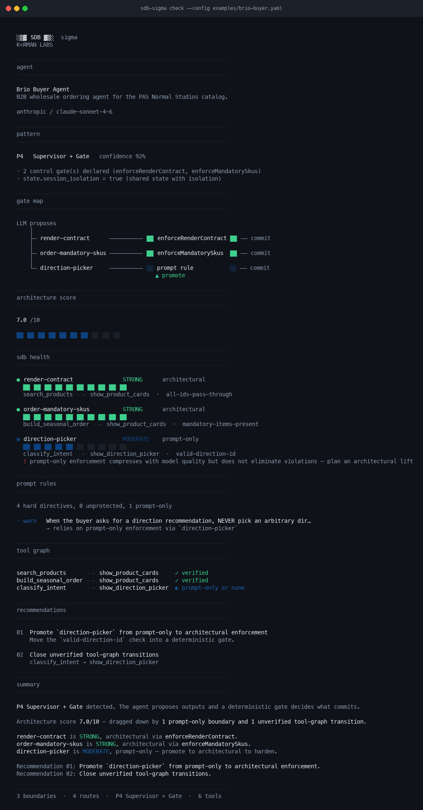

# SDB-sigma

Audit your agent architecture. Find boundary failures before production does.

## Why this exists

If you're building agentic systems with tool use, you've probably hit this: the LLM calls a search tool, gets 24 results back, and passes 19 of them to the render tool. Or it skips the render tool entirely and summarizes the results in text. Or it drops 2 of 8 mandatory items from an order because it decided they weren't relevant.

You add "you MUST include all results" to the system prompt. It works 85% of the time. You make the instruction stronger. It works 92% of the time. You bold it, capitalize it, add "CRITICAL" and "non-negotiable." It works 95% of the time.

5% of your orders are wrong. That's not a model problem. That's an architecture problem.

The fix is not a better prompt. The fix is a deterministic gate between what the LLM proposes and what the system commits. A function that checks: did the render tool receive every ID the search tool returned? If not, swap in the correct set. The LLM never knows. The user never sees incomplete results.

That gate is what this tool audits.

## The boundary

Every production agent has points where stochastic LLM output becomes a deterministic system action. A tool call. A database write. A rendered UI component. [Srinivasan (2026)](https://arxiv.org/abs/2605.20173) names this the stochastic-deterministic boundary (SDB) and defines it as a four-part contract:

```
  LLM generates          deterministic            durable write
  a proposal      --->   check validates    --->   or action
  (proposer)             (verifier)                (commit)
                              |
                              |  fails
                              v
                         typed error back
                         to the LLM
                         (reject signal)
```



When all four parts are present, the boundary is strong. When the verifier is missing (the LLM's proposal commits directly), the boundary is weak. When the verifier is a prompt instruction instead of code, the boundary is somewhere in between and will degrade under pressure.

The paper audited 21 published agent failure post-mortems. 15 of them (71%) traced to a missing or weak part of this contract. Not model errors. Boundary errors.

SDB-sigma finds every boundary in your agent, scores how strong each one is, and tells you which ones will break first.

## How scoring works

The paper separates two forces in agent reliability:

**Sigma** is per-call variance from the LLM. It compresses with every model generation. Sonnet is better than Haiku. Opus is better than Sonnet. This force improves on its own.

**Mu** is architectural momentum. It's set by your pattern choice and the strength of your boundaries. It does not improve when you upgrade models. A missing gate is still a missing gate whether you're running Haiku or Opus.

SDB-sigma measures mu. The architecture score (0 to 10) answers one question: will better models fix your reliability problems, or is the issue structural?

Boundary enforcement contributes 60% of the score (architectural = 10 points, prompt-only = 5, none = 1). Pattern classification confidence contributes 25%. Penalties apply for unprotected prompt rules, pattern/control mismatches, and unverified tool graph transitions.

## What it checks

Four static analyzers run against your YAML config:

**SDB audit** finds every declared boundary and scores its enforcement. Level 0: no verifier, the LLM's output commits directly. Level 1: prompt-only, the LLM is instructed but nothing deterministic enforces the rule. Level 2: architectural, a named gate function sits between proposal and commit.

**Pattern classification** maps your agent to one of six runtime patterns from the Srinivasan catalog. P1 Hierarchical Delegation. P2 Scatter-Gather + Saga. P3 Event-Driven Sequencing. P4 Supervisor + Gate. P5 Shared State Machine. P6 Human in the Loop. It flags mismatches between the pattern your architecture implies and the control mechanisms you actually have.

**Prompt analysis** parses your system prompt for MUST, NEVER, and ALWAYS directives and cross-references each against your declared boundaries. A hard directive without a matching gate is flagged. These are the rules that will fail under model version changes, longer context windows, or adversarial user inputs.

**Tool graph** maps data flow between your tools. Which tool produces data, which tool consumes it, and is there a gate in between. Unverified transitions and dead ends are surfaced.

The output includes a **gate map** that renders the entire data flow as a tree, showing each boundary passing through an architectural gate, a prompt rule, or nothing.

## Where this came from

SDB-sigma was built while solving these exact problems in production.

At K<RMAN LABS we run a B2B wholesale ordering platform with a conversational agent interface. The agent handles product search, order assembly, and buyer interactions across a three-type routing architecture:

**Type A** (free-flow): open-ended LLM responses. No verifier. The weakest boundary in the system. Every response is an unprotected proposal.

**Type B** (deterministic playbook): structured order flows driven by supplier-authored playbooks with mandatory SKU sets. A render contract enforcer sits between the LLM's tool call and the UI commit. It records the expected output from the data tool, then validates the render tool's input against that expectation. If the LLM trimmed results or dropped a mandatory item, the enforcer silently swaps in the correct set. The LLM never retries. The user never sees incomplete data.

**Type C** (deterministic search): product lookup where the full result set from the search tool must pass through to the render tool unchanged. Same enforcement pattern. The gate compares submitted IDs against expected IDs and overrides on mismatch.

The render contract enforcer is a production SDB. It implements all four parts of the boundary contract: the LLM proposes (tool call), the enforcer verifies (set comparison), the UI commits (render), and on failure the enforcer either overrides silently or injects a remediation message for the next loop round (reject signal).

The patterns and failure modes across these three types are what the diagnostic checks in SDB-sigma test for.

## Quick start

```bash
# generate a starter config
npx sdb-sigma init

# run the audit
npx sdb-sigma check --config sdb-sigma.config.yaml

# json output for CI
npx sdb-sigma check --config sdb-sigma.config.yaml --json
```

## Example output

Running against `examples/brio-buyer.yaml`:



```
  ░▒▓ SDB ▓▒░  sigma
  K<RMAN LABS

  ────────────────────────────────────────────────────────────────
  agent
  ────────────────────────────────────────────────────────────────

  Brio Buyer Agent
  B2B wholesale ordering agent for the PAS Normal Studios catalog.

  anthropic / claude-sonnet-4-6

  ────────────────────────────────────────────────────────────────
  pattern
  ────────────────────────────────────────────────────────────────

  P4   Supervisor + Gate   confidence 92%

  · 2 control gate(s) declared (enforceRenderContract, enforceMandatorySkus)
  · state.session_isolation = true (shared state with isolation)

  ────────────────────────────────────────────────────────────────
  gate map
  ────────────────────────────────────────────────────────────────

  LLM proposes
      │
      ├─ render-contract ────────── ██ enforceRenderContract ██ ── commit
      │
      ├─ order-mandatory-skus ──── ██ enforceMandatorySkus  ██ ── commit
      │
      └─ direction-picker ──────── ░░ prompt rule           ░░ ── commit
                                                         ▲ promote

  ────────────────────────────────────────────────────────────────
  architecture score
  ────────────────────────────────────────────────────────────────

  7.0 /10

  ██ ██ ██ ██ ██ ██ ██ ██ ██ ██

  ────────────────────────────────────────────────────────────────
  sdb health
  ────────────────────────────────────────────────────────────────

  ● render-contract               STRONG      architectural
    ██ ██ ██ ██ ██ ██ ██ ██ ██ ██
    search_products ╌╌► show_product_cards  ·  all-ids-pass-through

  ● order-mandatory-skus          STRONG      architectural
    ██ ██ ██ ██ ██ ██ ██ ██ ██ ██
    build_seasonal_order ╌╌► show_product_cards  ·  mandatory-items-present

  ● direction-picker              MODERATE    prompt-only
    ██ ██ ██ ██ ██ ██ ██ ██ ██ ██
    classify_intent ╌╌► show_direction_picker  ·  valid-direction-id

  ────────────────────────────────────────────────────────────────
  tool graph
  ────────────────────────────────────────────────────────────────

  search_products      ╌╌► show_product_cards     ✓ verified
  build_seasonal_order ╌╌► show_product_cards     ✓ verified
  classify_intent      ╌╌► show_direction_picker  ◐ prompt-only or none

  ────────────────────────────────────────────────────────────────
  recommendations
  ────────────────────────────────────────────────────────────────

  01  Promote `direction-picker` from prompt-only to architectural enforcement
      Move the `valid-direction-id` check into a deterministic gate.

  02  Close unverified tool-graph transitions
      classify_intent → show_direction_picker

  ────────────────────────────────────────────────────────────────
  summary
  ────────────────────────────────────────────────────────────────

  P4 Supervisor + Gate detected. The agent proposes outputs and a
  deterministic gate decides what commits.

  Architecture score 7.0/10, dragged down by 1 prompt-only boundary
  and 1 unverified tool-graph transition.

  render-contract is STRONG, architectural via enforceRenderContract.
  order-mandatory-skus is STRONG, architectural via enforceMandatorySkus.
  direction-picker is MODERATE, prompt-only. Promote to architectural
  to harden.

  ────────────────────────────────────────────────────────────────
  3 boundaries  ·  4 routes  ·  P4 Supervisor + Gate  ·  6 tools
```

## Configuration

Run `sdb-sigma init` for a starter config. See `examples/brio-buyer.yaml` for a production example. The full schema:

```yaml
name: My Agent
description: What this agent does.

agent:
  provider: anthropic
  model: claude-sonnet-4-6
  system_prompt: |
    Your system prompt. Include MUST/NEVER/ALWAYS
    rules so the prompt analyzer can audit them.
  max_rounds: 4

routing:
  strategy: tool-selection
  types:
    - name: free-flow
      description: Open-ended LLM responses
      tools: []
    - name: search
      description: Product search
      tools: [search_products, show_product_cards]

boundaries:
  - name: render-contract
    data_tool: search_products
    render_tool: show_product_cards
    contract: all-ids-pass-through
    enforcement: architectural     # architectural | prompt-only | none

state:
  persistence: client-side
  context_window: prompt-injection
  session_isolation: true

control:
  gates: [enforceRenderContract]
  human_approval: false
  max_rounds: 4
  rate_limiting: true
```

## Limitations

This is static analysis. v1 validates the architecture you declare in YAML, not runtime behavior. It does not make LLM calls. It does not measure actual variance or task abandonment rates. It does not parse your source code to discover boundaries automatically.

The tool is most useful as a forcing function. Writing the config is where most of the insight happens. You have to name your boundaries, declare their enforcement level, and confront the ones that have no gate. Most teams have never done that exercise explicitly.

## Roadmap

**v2**: Dynamic testing. Run your agent against real LLM calls N times, measure variance per boundary, detect task abandonment (LLM returns text instead of calling tools), stress test boundaries with adversarial inputs that invite curation.

**v3**: CI integration (fail the build if score drops). Auto-generated enforcement code. Multi-agent support. Replay divergence testing across model versions.

## License

MIT

K<RMAN LABS
